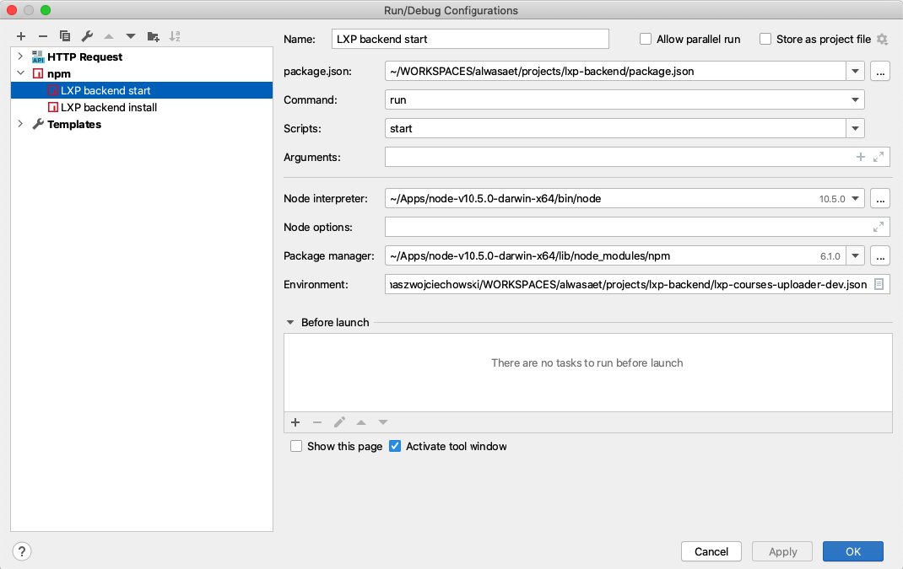
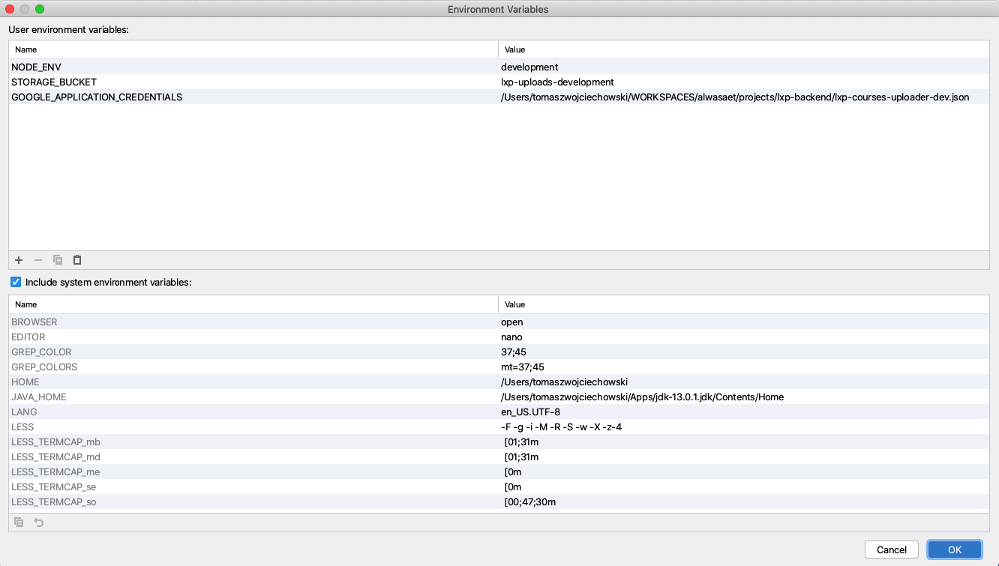

###

1. Setup env like below

2. Environment variables setup

**NODE_ENV** - define the runtime environment. For local development it should set to 'development'.

**STORAGE_BUCKET** - Google Cloud storage bucket name where files will be uploaded. Take a look into 'lxp-api.config.js' to get more info about naming convention used for storage bucket in LXP project.   

**GOOGLE_APPLICATION_CREDENTIALS** - this variable define where to find service acount key (it is in main project directory. it is called 'lxp-courses-uploader-dev.json'). This variable should contain path to this file. On staging and production this env variable is automaticaly provided by runtime environment. All Google Cloud libraries are searching (including nodejs-storage library) this variable while initializing access to Google Cloud services. There is not reference in our code to this variable!!

